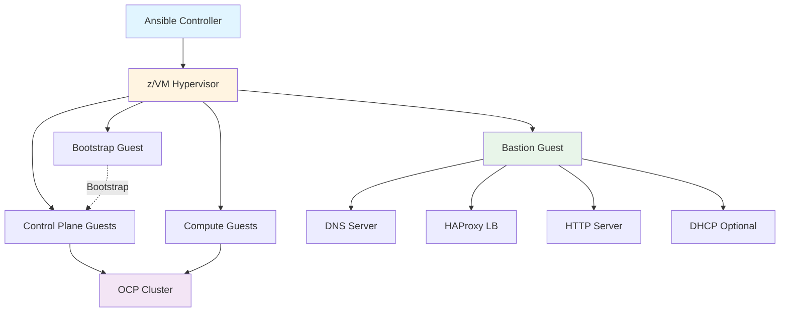
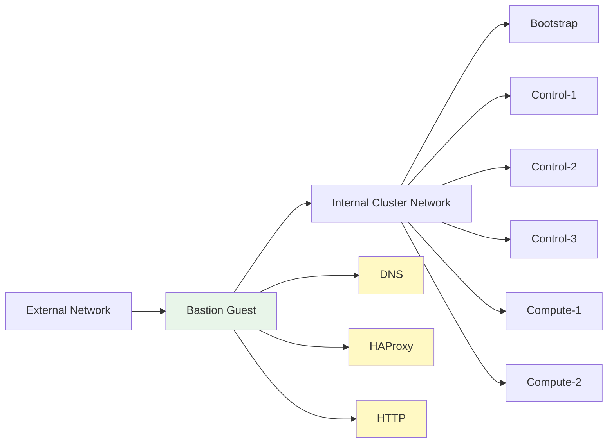
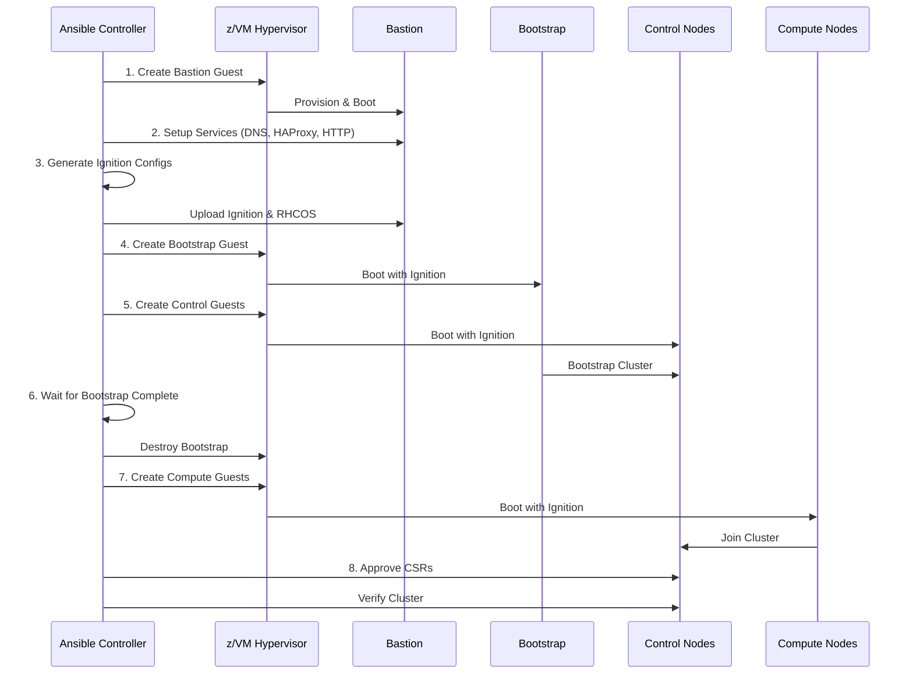

# z/VM UPI Implementation Plan

## Executive Summary

This document outlines the implementation plan for adding full User Provisioned Infrastructure (UPI) support for IBM Z z/VM-based OpenShift Container Platform clusters in the Ansible-OpenShift-Provisioning repository.

**Target**: Create a complete z/VM UPI deployment path similar to the existing KVM-based [`site.yaml`](../playbooks/site.yaml) workflow.

**Base Template**: All z/VM node configurations will use [`node.yaml.template`](../inventories/default/host_vars/node.yaml.template) as the foundation.

---

## Current State Analysis

### Existing z/VM Support

The repository currently has partial z/VM support:

| Feature | Status | Implementation |
|---------|--------|----------------|
| **ABI Deployment** | ✅ Supported | [`create_abi_cluster.yaml`](../playbooks/create_abi_cluster.yaml) with [`boot_zvm_nodes`](../roles/boot_zvm_nodes/tasks/main.yaml) role |
| **HCP Compute Nodes** | ✅ Supported | [`boot_zvm_nodes_hcp`](../roles/boot_zvm_nodes_hcp/tasks/main.yaml) role for hosted control planes |
| **Configuration** | ✅ Partial | [`zvm.yaml`](../inventories/default/group_vars/zvm.yaml) for basic z/VM settings |
| **Node Template** | ✅ Available | [`node.yaml.template`](../inventories/default/host_vars/node.yaml.template) for hardware-level config |
| **UPI Deployment** | ❌ Missing | No equivalent to [`site.yaml`](../playbooks/site.yaml) for z/VM |

### Identified Gaps for UPI Deployment

1. **No Master Playbook**: Missing z/VM equivalent of [`site.yaml`](../playbooks/site.yaml)
2. **No Bastion Provisioning**: No playbooks for creating bastion on z/VM
3. **No UPI Ignition Flow**: Missing ignition generation and delivery for z/VM UPI
4. **Limited Guest Management**: No comprehensive z/VM guest lifecycle roles
5. **No z/VM Inventory Structure**: Missing templates for z/VM-specific inventory
6. **Documentation Gap**: No UPI deployment guide for z/VM

---

## Architecture Design

### z/VM UPI Deployment Architecture



### Component Mapping

| Component | z/VM Implementation | Configuration Source | Resources |
|-----------|-------------------|---------------------|-----------|
| **Hypervisor** | z/VM LPAR | z/VM host credentials | N/A |
| **Bastion** | z/VM Guest | [`node.yaml.template`](../inventories/default/host_vars/node.yaml.template) | 4 vCPU, 8GB RAM, 30GB disk |
| **Bootstrap** | z/VM Guest | [`node.yaml.template`](../inventories/default/host_vars/node.yaml.template) | 4 vCPU, 16GB RAM, 120GB disk |
| **Control Nodes** | z/VM Guests (3x) | [`node.yaml.template`](../inventories/default/host_vars/node.yaml.template) | 4 vCPU, 16GB RAM, 120GB disk each |
| **Compute Nodes** | z/VM Guests (2+) | [`node.yaml.template`](../inventories/default/host_vars/node.yaml.template) | 4 vCPU, 16GB RAM, 120GB disk each |
| **Storage** | DASD or FCP | [`zvm.yaml`](../inventories/default/group_vars/zvm.yaml) disk_type | Per node requirements |
| **Network** | vSwitch/OSA/RoCE/Hipersockets | [`zvm.yaml`](../inventories/default/group_vars/zvm.yaml) network_mode | Cluster network |

### Network Architecture



### Deployment Workflow



---

## Implementation Plan

### Phase 1: Foundation (Playbooks & Inventory)

#### 1.1 Master Playbook

**File**: `playbooks/site_zvm.yaml`

**Purpose**: Main orchestration playbook for z/VM UPI deployment

**Structure**:
```yaml
---
# Master playbook for z/VM UPI deployment
- import_playbook: 0_setup_zvm.yaml
- import_playbook: 1_create_zvm_bastion.yaml
- import_playbook: 2_setup_zvm_bastion.yaml
- import_playbook: 3_prepare_zvm_guests.yaml
- import_playbook: 4_create_zvm_nodes.yaml
- import_playbook: 5_verify_zvm_cluster.yaml
- import_playbook: disconnected_apply_operator_manifests.yaml
  when: disconnected.enabled
```

**Key Features**:
- Sequential execution similar to [`site.yaml`](../playbooks/site.yaml)
- Support for `installation_type: zvm`
- Disconnected/air-gapped support
- Conditional execution based on configuration

#### 1.2 Inventory Structure

**Directory**: `inventories/default/`

**New Files**:

1. **Group Variables**
   - `group_vars/all_zvm.yaml.template` - z/VM-specific global variables
   
2. **Host Variables** (based on [`node.yaml.template`](../inventories/default/host_vars/node.yaml.template))
   - `host_vars/bastion-zvm.yaml.template`
   - `host_vars/bootstrap-zvm.yaml.template`
   - `host_vars/control-1-zvm.yaml.template`
   - `host_vars/control-2-zvm.yaml.template`
   - `host_vars/control-3-zvm.yaml.template`
   - `host_vars/compute-1-zvm.yaml.template`
   - `host_vars/compute-2-zvm.yaml.template`

**Inventory Hosts File Update**:
```ini
[localhost]
127.0.0.1 ansible_connection=local

[zvm_host]
zvm.example.com ansible_user=admin

[bastion_zvm]
bastion.example.com ansible_user=root

[bootstrap_zvm]
bootstrap.ocp-zvm.example.com

[control_zvm]
control-1.ocp-zvm.example.com
control-2.ocp-zvm.example.com
control-3.ocp-zvm.example.com

[compute_zvm]
compute-1.ocp-zvm.example.com
compute-2.ocp-zvm.example.com
```

---

### Phase 2: Sequential Playbooks

#### 2.1 Setup Playbook

**File**: `playbooks/0_setup_zvm.yaml`

**Purpose**: Initial setup and prerequisites

**Tasks**:
- Generate SSH keys for Ansible and OCP
- Validate z/VM connectivity
- Check z/VM hypervisor prerequisites
- Install required packages on Ansible controller
- Validate inventory configuration
- Create working directories

**Roles**:
- `ssh_key_gen`
- `ssh_ocp_key_gen`
- `validate_zvm_config` (new)
- `install_packages`

#### 2.2 Bastion Creation Playbook

**File**: `playbooks/1_create_zvm_bastion.yaml`

**Purpose**: Provision bastion guest on z/VM

**Tasks**:
- Create z/VM guest definition for bastion
- Attach network interfaces (based on network_mode)
- Attach storage (DASD or FCP)
- Boot bastion guest with RHEL
- Configure basic networking
- Enable SSH access

**Roles**:
- `create_zvm_bastion` (new)
- `configure_zvm_network` (new)
- `attach_zvm_storage` (new)

**Configuration Source**: [`node.yaml.template`](../inventories/default/host_vars/node.yaml.template)

#### 2.3 Bastion Setup Playbook

**File**: `playbooks/2_setup_zvm_bastion.yaml`

**Purpose**: Configure bastion services

**Tasks**:
- Install packages (bind, haproxy, httpd, firewalld)
- Configure DNS server with cluster zones
- Setup HAProxy load balancer
- Configure HTTP server for ignition/RHCOS
- Setup firewall rules
- Optional: Configure DHCP server

**Roles**:
- `setup_zvm_bastion` (new, wraps existing roles)
- `dns` (reuse with z/VM adaptations)
- `haproxy` (reuse with z/VM adaptations)
- `httpd` (reuse)
- `set_firewall` (reuse)

#### 2.4 Guest Preparation Playbook

**File**: `playbooks/3_prepare_zvm_guests.yaml`

**Purpose**: Prepare for cluster node creation

**Tasks**:
- Download RHCOS kernel, initramfs, rootfs
- Generate OpenShift install-config.yaml
- Create ignition configs (bootstrap, master, worker)
- Upload ignition configs to bastion HTTP server
- Prepare z/VM guest definitions
- Generate parm files for each node

**Roles**:
- `get_ocp` (reuse)
- `prepare_zvm_ignition` (new)
- `prepare_zvm_guests` (new)

#### 2.5 Node Creation Playbook

**File**: `playbooks/4_create_zvm_nodes.yaml`

**Purpose**: Create and boot cluster nodes

**Tasks**:
1. **Bootstrap Phase**
   - Create bootstrap guest
   - Attach storage and network
   - Boot with bootstrap ignition
   - Wait for bootstrap API availability

2. **Control Plane Phase**
   - Create control plane guests (3x)
   - Attach storage and network
   - Boot with master ignition
   - Wait for control plane initialization

3. **Bootstrap Completion**
   - Wait for bootstrap completion
   - Destroy bootstrap guest

4. **Compute Phase**
   - Create compute guests
   - Attach storage and network
   - Boot with worker ignition
   - Approve CSRs automatically

**Roles**:
- `create_zvm_bootstrap` (new)
- `create_zvm_control_nodes` (new)
- `create_zvm_compute_nodes` (new)
- `boot_zvm_node_upi` (new)
- `wait_for_bootstrap` (reuse)
- `approve_certs` (reuse)

**Configuration Source**: [`node.yaml.template`](../inventories/default/host_vars/node.yaml.template) for each node

#### 2.6 Verification Playbook

**File**: `playbooks/5_verify_zvm_cluster.yaml`

**Purpose**: Verify cluster health and readiness

**Tasks**:
- Check all nodes are Ready
- Verify cluster operators
- Test DNS resolution
- Verify load balancer connectivity
- Check storage provisioning
- Validate network connectivity
- Generate cluster access information

**Roles**:
- `check_nodes` (reuse)
- `wait_for_cluster_operators` (reuse)
- `verify_zvm_cluster` (new)

---

### Phase 3: Ansible Roles

#### 3.1 Bastion Roles

##### Role: `create_zvm_bastion`

**Purpose**: Create bastion guest on z/VM

**Directory Structure**:
```
roles/create_zvm_bastion/
├── tasks/
│   └── main.yaml
├── templates/
│   ├── bastion_guest.j2
│   └── bastion_network.j2
├── defaults/
│   └── main.yaml
└── vars/
    └── main.yaml
```

**Key Tasks**:
1. Read bastion configuration from [`node.yaml.template`](../inventories/default/host_vars/node.yaml.template)
2. Create z/VM guest using tessia-baselib
3. Configure CPU and memory
4. Attach network interfaces
5. Attach storage (DASD or FCP)
6. Boot guest with RHEL ISO
7. Wait for SSH availability

**Templates**:
- `bastion_guest.j2` - Guest definition
- `bastion_network.j2` - Network configuration script

**Dependencies**:
- tessia-baselib Python package
- z/VM credentials
- RHEL ISO location

##### Role: `setup_zvm_bastion`

**Purpose**: Configure bastion services

**Directory Structure**:
```
roles/setup_zvm_bastion/
├── tasks/
│   ├── main.yaml
│   ├── install_packages.yaml
│   ├── configure_dns.yaml
│   ├── configure_haproxy.yaml
│   ├── configure_httpd.yaml
│   └── configure_firewall.yaml
├── templates/
│   ├── named.conf.j2
│   ├── zone.db.j2
│   ├── haproxy.cfg.j2
│   └── httpd.conf.j2
└── defaults/
    └── main.yaml
```

**Key Tasks**:
1. Install required packages
2. Configure DNS (bind) with cluster zones
3. Setup HAProxy for API and ingress
4. Configure HTTP server for ignition/RHCOS
5. Setup firewall rules
6. Enable and start services

**Reuses**:
- [`dns`](../roles/dns/tasks/main.yaml) role logic
- [`haproxy`](../roles/haproxy/tasks/main.yaml) role logic
- [`httpd`](../roles/httpd/tasks/main.yaml) role logic

#### 3.2 Node Creation Roles

##### Role: `create_zvm_bootstrap`

**Purpose**: Create bootstrap node on z/VM

**Directory Structure**:
```
roles/create_zvm_bootstrap/
├── tasks/
│   └── main.yaml
├── templates/
│   ├── bootstrap_guest.j2
│   ├── bootstrap.parm.j2
│   └── bootstrap_storage.j2
└── defaults/
    └── main.yaml
```

**Key Tasks**:
1. Read bootstrap config from [`node.yaml.template`](../inventories/default/host_vars/node.yaml.template)
2. Create z/VM guest for bootstrap
3. Attach storage (120GB DASD or FCP)
4. Configure network interface
5. Generate parm file with ignition URL
6. Boot with RHCOS kernel/initramfs
7. Wait for bootstrap API

**Based On**: [`create_bootstrap`](../roles/create_bootstrap/tasks/main.yaml) adapted for z/VM

##### Role: `create_zvm_control_nodes`

**Purpose**: Create control plane nodes on z/VM

**Directory Structure**:
```
roles/create_zvm_control_nodes/
├── tasks/
│   └── main.yaml
├── templates/
│   ├── control_guest.j2
│   ├── master.parm.j2
│   └── control_storage.j2
└── defaults/
    └── main.yaml
```

**Key Tasks**:
1. Loop through control nodes (typically 3)
2. Read each node config from [`node.yaml.template`](../inventories/default/host_vars/node.yaml.template)
3. Create z/VM guest for each control node
4. Attach storage (120GB DASD or FCP)
5. Configure network interface
6. Generate parm file with master ignition URL
7. Boot with RHCOS kernel/initramfs
8. Wait for nodes to join cluster

**Based On**: [`create_control_nodes`](../roles/create_control_nodes/tasks/main.yaml) adapted for z/VM

##### Role: `create_zvm_compute_nodes`

**Purpose**: Create compute nodes on z/VM

**Directory Structure**:
```
roles/create_zvm_compute_nodes/
├── tasks/
│   └── main.yaml
├── templates/
│   ├── compute_guest.j2
│   ├── worker.parm.j2
│   └── compute_storage.j2
└── defaults/
    └── main.yaml
```

**Key Tasks**:
1. Loop through compute nodes
2. Read each node config from [`node.yaml.template`](../inventories/default/host_vars/node.yaml.template)
3. Create z/VM guest for each compute node
4. Attach storage (120GB DASD or FCP)
5. Configure network interface
6. Generate parm file with worker ignition URL
7. Boot with RHCOS kernel/initramfs
8. Wait for nodes to join cluster

#### 3.3 Boot and Configuration Roles

##### Role: `boot_zvm_node_upi`

**Purpose**: Boot individual z/VM guest with ignition

**Directory Structure**:
```
roles/boot_zvm_node_upi/
├── tasks/
│   └── main.yaml
├── templates/
│   ├── boot_zvm_upi.py.j2
│   ├── node.parm.j2
│   └── ignition_url.j2
└── defaults/
    └── main.yaml
```

**Key Tasks**:
1. Generate parm file with network and ignition parameters
2. Use tessia-baselib to boot guest
3. Specify kernel, initramfs, and cmdline
4. Configure network interface (OSA/vSwitch/RoCE/Hipersockets)
5. Attach storage volumes
6. Monitor boot progress

**Python Script**: Enhanced version of [`boot_nodes.py`](../roles/boot_zvm_nodes/templates/boot_nodes.py)

**Key Enhancements**:
- Support for ignition URL in cmdline
- Storage volume attachment
- Multiple network modes
- Error handling and logging

##### Role: `attach_zvm_storage`

**Purpose**: Attach storage to z/VM guests

**Directory Structure**:
```
roles/attach_zvm_storage/
├── tasks/
│   ├── main.yaml
│   ├── attach_dasd.yaml
│   └── attach_fcp.yaml
├── templates/
│   ├── dasd_config.j2
│   └── fcp_config.j2
└── defaults/
    └── main.yaml
```

**Key Tasks**:
1. Read storage config from [`node.yaml.template`](../inventories/default/host_vars/node.yaml.template)
2. For DASD:
   - Attach DASD device to guest
   - Configure device online
   - Format if needed
3. For FCP:
   - Attach FCP adapter
   - Configure WWPN and LUN
   - Scan for devices

**Supports**: Both disk types from [`zvm.yaml`](../inventories/default/group_vars/zvm.yaml)

##### Role: `configure_zvm_network`

**Purpose**: Configure network interfaces for z/VM guests

**Directory Structure**:
```
roles/configure_zvm_network/
├── tasks/
│   ├── main.yaml
│   ├── configure_osa.yaml
│   ├── configure_vswitch.yaml
│   ├── configure_roce.yaml
│   └── configure_hipersockets.yaml
├── templates/
│   ├── osa_config.j2
│   ├── vswitch_config.j2
│   ├── roce_config.j2
│   └── hipersockets_config.j2
└── defaults/
    └── main.yaml
```

**Key Tasks**:
1. Read network config from [`node.yaml.template`](../inventories/default/host_vars/node.yaml.template)
2. Configure based on network_mode:
   - **OSA**: Configure OSA adapter with subchannels
   - **vSwitch**: Connect to z/VM virtual switch
   - **RoCE**: Configure RoCE adapter
   - **Hipersockets**: Configure Hipersockets interface
3. Set IP address, netmask, gateway
4. Configure DNS servers
5. Enable interface

**Based On**: [`zvm.yaml`](../inventories/default/group_vars/zvm.yaml) network_mode

##### Role: `prepare_zvm_ignition`

**Purpose**: Generate and prepare ignition configs for z/VM

**Directory Structure**:
```
roles/prepare_zvm_ignition/
├── tasks/
│   ├── main.yaml
│   ├── generate_configs.yaml
│   ├── upload_configs.yaml
│   └── generate_parms.yaml
├── templates/
│   ├── install-config.yaml.j2
│   ├── bootstrap.parm.j2
│   ├── master.parm.j2
│   └── worker.parm.j2
└── defaults/
    └── main.yaml
```

**Key Tasks**:
1. Generate install-config.yaml
2. Run openshift-install to create ignition configs
3. Upload ignition configs to bastion HTTP server
4. Generate parm files for each node type
5. Include network configuration in parm files
6. Include ignition URL in parm files

**Parm File Content**:
```
rd.neednet=1 coreos.inst.install_dev=/dev/dasda 
coreos.inst.ignition_url=http://bastion.example.com:8080/bootstrap.ign
ip=192.168.1.10::192.168.1.1:255.255.255.0:bootstrap.ocp.example.com:enc1000:none
nameserver=192.168.1.20
rd.znet=qeth,0.0.1000,0.0.1001,0.0.1002,layer2=1
```

---

### Phase 4: Templates and Scripts

#### 4.1 Ignition Templates

**Purpose**: Customize ignition configs for z/VM specifics

**Files**:
- `roles/prepare_zvm_ignition/templates/install-config.yaml.j2`
- `roles/prepare_zvm_ignition/templates/bootstrap.ign.j2` (if customization needed)
- `roles/prepare_zvm_ignition/templates/master.ign.j2` (if customization needed)
- `roles/prepare_zvm_ignition/templates/worker.ign.j2` (if customization needed)

**Key Customizations**:
- Network configuration for z/VM
- Storage device paths (DASD vs FCP)
- z/VM-specific kernel parameters
- Custom certificates if needed

#### 4.2 Parm File Templates

**Purpose**: Generate parm files for booting z/VM guests

**Files**:
- `roles/boot_zvm_node_upi/templates/bootstrap.parm.j2`
- `roles/boot_zvm_node_upi/templates/master.parm.j2`
- `roles/boot_zvm_node_upi/templates/worker.parm.j2`

**Template Structure**:
```jinja2
rd.neednet=1 
coreos.inst.install_dev={{ storage_device }}
coreos.inst.ignition_url={{ ignition_url }}
ip={{ ip_address }}::{{ gateway }}:{{ netmask }}:{{ hostname }}:{{ interface }}:none
nameserver={{ nameserver }}
rd.znet={{ network_type }},{{ subchannels }},{{ options }}

rd.dasd={{ dasd_device }}

rd.zfcp={{ fcp_adapter }},{{ wwpn }},{{ lun }}

```

**Variables Source**: [`node.yaml.template`](../inventories/default/host_vars/node.yaml.template)

#### 4.3 Python Scripts

##### Script: `boot_zvm_upi.py`

**File**: `roles/boot_zvm_node_upi/templates/boot_zvm_upi.py.j2`

**Purpose**: Enhanced boot script for UPI deployment

**Based On**: [`boot_nodes.py`](../roles/boot_zvm_nodes/templates/boot_nodes.py)

**Enhancements**:
```python
#!/usr/bin/env python3
from tessia.baselib.hypervisors.zvm.zvm import HypervisorZvm
import argparse
import logging

# Enhanced argument parsing
parser = argparse.ArgumentParser(description="Boot z/VM guest for OCP UPI")
parser.add_argument("--zvmname", required=True)
parser.add_argument("--zvmhost", required=True)
parser.add_argument("--zvmuser", required=True)
parser.add_argument("--zvmpass", required=True)
parser.add_argument("--cpu", type=int, required=True)
parser.add_argument("--memory", type=int, required=True)
parser.add_argument("--kernel", required=True)
parser.add_argument("--initrd", required=True)
parser.add_argument("--cmdline", required=True)
parser.add_argument("--network", required=True)
parser.add_argument("--storage-type", choices=['dasd', 'fcp'], required=True)
parser.add_argument("--storage-device", required=True)

# Storage volume configuration
storage_volumes = []
if args.storage_type == 'dasd':
    storage_volumes.append({
        "type": "dasd",
        "devno": args.storage_device
    })
elif args.storage_type == 'fcp':
    storage_volumes.append({
        "type": "fcp",
        "adapter": args.fcp_adapter,
        "wwpn": args.wwpn,
        "lun": args.lun
    })

# Network interface configuration
interfaces = []
if args.network in ['osa', 'vswitch', 'hipersockets']:
    interfaces.append({
        "type": "osa",
        "id": args.subchannels
    })
elif args.network == 'roce':
    interfaces.append({
        "type": "pci",
        "id": args.interface
    })

# Guest parameters
guest_parameters = {
    "boot_method": "network",
    "storage_volumes": storage_volumes,
    "ifaces": interfaces,
    "netboot": {
        "cmdline": args.cmdline,
        "kernel_uri": args.kernel,
        "initrd_uri": args.initrd,
    }
}

# Boot guest
zvm = HypervisorZvm(args.zvmname, args.zvmhost, args.zvmuser, args.zvmpass)
zvm.login()
zvm.start(args.zvmuser, args.cpu, args.memory, guest_parameters)
zvm.logoff()
```

---

### Phase 5: Configuration Files

#### 5.1 Group Variables Template

**File**: `inventories/default/group_vars/all_zvm.yaml.template`

**Purpose**: z/VM-specific global configuration

**Structure**:
```yaml
# Installation Type
installation_type: zvm

# Ansible Controller
controller_sudo_pass: #X

env:
  # z/VM Hypervisor Configuration
  zvm_host:
    hostname: #X  # z/VM LPAR hostname
    ip: #X        # z/VM LPAR IP address
    user: #X      # z/VM admin user
    pass: #X      # z/VM admin password (use vault)

  # File Server (for RHEL/RHCOS ISOs)
  file_server:
    ip: #X
    port: ''
    user: #X
    pass: #X
    protocol: #X  # http, ftp, nfs
    iso_mount_dir: #X
    iso_os_variant: #X
    cfgs_dir: #X

  # Red Hat Credentials
  redhat:
    username: #X
    password: #X
    manage_subscription: True
    pull_secret: #'X'

  # Bastion Configuration (using node.yaml.template structure)
  bastion:
    create: True
    # Hardware settings from node.yaml.template
    hostname: bastion
    nodename: BASTION
    host_ip: #X
    node_user: root
    node_user_pwd: #X
    cpu: 4
    memory: 8192
    
    # Network configuration
    network:
      - ip: #X
        ipv6: #X
        gateway: #X
        gatewayv6: #X
        netmask: #X
        netmaskv6: #X
        device: #X  # e.g., enc1000
    
    # Storage configuration
    zrd_dasd:
      - #X  # e.g., 0.0.0100
    # OR for FCP
    zrd_fcp:
      - #X  # e.g., 0.0.1a00
    
    # Network device configuration
    zrd_znet:
      - #X  # e.g., 0.0.1000,0.0.1001,0.0.1002
    
    nameserver:
      - #X
    
    # Services
    options:
      dns: True
      loadbalancer:
        on_bastion: True

  # Cluster Configuration
  cluster:
    networking:
      metadata_name: #X  # e.g., ocp-zvm
      base_domain: #X    # e.g., example.com
      subnetmask: #X
      gateway: #X
      ipv6_gateway: #X
      ipv6_prefix: #X
      nameserver1: #X
      forwarder: 1.1.1.1
      interface: #X

    # Bootstrap Node (using node.yaml.template structure)
    nodes:
      bootstrap:
        hostname: bootstrap
        nodename: BOOTSTRP
        host_ip: #X
        node_user: core
        cpu: 4
        memory: 16384
        network:
          - ip: #X
            gateway: #X
            netmask: #X
            device: #X
        zrd_dasd:
          - #X  # 120GB DASD
        zrd_znet:
          - #X
        nameserver:
          - #X

      # Control Nodes (using node.yaml.template structure)
      control:
        - hostname: control-1
          nodename: CONTROL1
          host_ip: #X
          node_user: core
          cpu: 4
          memory: 16384
          network:
            - ip: #X
              gateway: #X
              netmask: #X
              device: #X
          zrd_dasd:
            - #X  # 120GB DASD
          zrd_znet:
            - #X
          nameserver:
            - #X
        
        - hostname: control-2
          nodename: CONTROL2
          # ... similar structure
        
        - hostname: control-3
          nodename: CONTROL3
          # ... similar structure

      # Compute Nodes (using node.yaml.template structure)
      compute:
        - hostname: compute-1
          nodename: COMPUTE1
          host_ip: #X
          node_user: core
          cpu: 4
          memory: 16384
          network:
            - ip: #X
              gateway: #X
              netmask: #X
              device: #X
          zrd_dasd:
            - #X  # 120GB DASD
          zrd_znet:
            - #X
          nameserver:
            - #X
        
        - hostname: compute-2
          nodename: COMPUTE2
          # ... similar structure

  # z/VM Specific Configuration (from zvm.yaml)
  zvm:
    network_mode: vswitch  # vswitch, osa, roce, hipersockets
    disk_type: dasd        # dasd, fcp
    subnetmask: #X
    gateway: #X
    nameserver: #X
    vcpus: 4
    memory: 16384

  # Miscellaneous
  language: en_US.UTF-8
  timezone: America/New_York
  keyboard: us
  root_access: false
  ansible_key_name: ansible-ocpz
  ocp_ssh_key_comment: OpenShift key
  use_ipv6: True
  use_dhcp: False

  # OCP Version
  ocp:
    version: 4.19.0
    download_url: https://mirror.openshift.com/pub/openshift-v4

# CEX Encryption (Optional)
cex: false

# Disconnected/Air-gapped (Optional)
# See disconnected.yaml for full configuration
```

#### 5.2 Host Variables Templates

All host variable templates are based on [`node.yaml.template`](../inventories/default/host_vars/node.yaml.template).

##### Template: `bastion-zvm.yaml.template`

**File**: `inventories/default/host_vars/bastion-zvm.yaml.template`

```yaml
##############################################################
# Bastion node configuration for z/VM UPI deployment
# Based on node.yaml.template
##############################################################

# Section 1 - General Settings
hostname: bastion
nodename: BASTION
host_ip: 192.168.1.20
node_user: root
node_user_pwd: "{{ vault_bastion_pwd }}"

# Section 2 - Hardware settings
attach_network: True
attach_disk: True
cpu: 4
memory: 8192
zfcp_allow_lun_scan: 0

# Storage configuration
zrd_fcp: []
zrd_dasd:
  - 0.0.0100  # 30GB for bastion OS

# Network configuration
zrd_znet:
  - 0.0.1000,0.0.1001,0.0.1002  # OSA/vSwitch subchannels

network:
  - ip: 192.168.1.20
    ipv6: fd00::20
    gateway: 192.168.1.1
    gatewayv6: fd00::1
    netmask: 255.255.255.0
    netmaskv6: 64
    device: enc1000

nameserver:
  - 8.8.8.8
  - 8.8.4.4
```

##### Template: `bootstrap-zvm.yaml.template`

**File**: `inventories/default/host_vars/bootstrap-zvm.yaml.template`

```yaml
##############################################################
# Bootstrap node configuration for z/VM UPI deployment
# Based on node.yaml.template
##############################################################

# Section 1 - General Settings
hostname: bootstrap
nodename: BOOTSTRP
host_ip: 192.168.1.30
node_user: core
node_user_pwd: "{{ vault_core_pwd }}"

# Section 2 - Hardware settings
attach_network: True
attach_disk: True
cpu: 4
memory: 16384
zfcp_allow_lun_scan: 0

# Storage configuration
zrd_fcp: []
zrd_dasd:
  - 0.0.0200  # 120GB for bootstrap

# Network configuration
zrd_znet:
  - 0.0.2000,0.0.2001,0.0.2002

network:
  - ip: 192.168.1.30
    ipv6: fd00::30
    gateway: 192.168.1.1
    gatewayv6: fd00::1
    netmask: 255.255.255.0
    netmaskv6: 64
    device: enc2000

nameserver:
  - 192.168.1.20  # Bastion DNS
```

##### Template: `control-1-zvm.yaml.template`

**File**: `inventories/default/host_vars/control-1-zvm.yaml.template`

```yaml
##############################################################
# Control node 1 configuration for z/VM UPI deployment
# Based on node.yaml.template
##############################################################

# Section 1 - General Settings
hostname: control-1
nodename: CONTROL1
host_ip: 192.168.1.31
node_user: core
node_user_pwd: "{{ vault_core_pwd }}"

# Section 2 - Hardware settings
attach_network: True
attach_disk: True
cpu: 4
memory: 16384
zfcp_allow_lun_scan: 0

# Storage configuration
zrd_fcp: []
zrd_dasd:
  - 0.0.0300  # 120GB for control plane

# Network configuration
zrd_znet:
  - 0.0.3000,0.0.3001,0.0.3002

network:
  - ip: 192.168.1.31
    ipv6: fd00::31
    gateway: 192.168.1.1
    gatewayv6: fd00::1
    netmask: 255.255.255.0
    netmaskv6: 64
    device: enc3000

nameserver:
  - 192.168.1.20  # Bastion DNS
```

##### Template: `compute-1-zvm.yaml.template`

**File**: `inventories/default/host_vars/compute-1-zvm.yaml.template`

```yaml
##############################################################
# Compute node 1 configuration for z/VM UPI deployment
# Based on node.yaml.template
##############################################################

# Section 1 - General Settings
hostname: compute-1
nodename: COMPUTE1
host_ip: 192.168.1.41
node_user: core
node_user_pwd: "{{ vault_core_pwd }}"

# Section 2 - Hardware settings
attach_network: True
attach_disk: True
cpu: 4
memory: 16384
zfcp_allow_lun_scan: 0

# Storage configuration
zrd_fcp: []
zrd_dasd:
  - 0.0.0500  # 120GB for compute

# Network configuration
zrd_znet:
  - 0.0.5000,0.0.5001,0.0.5002

network:
  - ip: 192.168.1.41
    ipv6: fd00::41
    gateway: 192.168.1.1
    gatewayv6: fd00::1
    netmask: 255.255.255.0
    netmaskv6: 64
    device: enc5000

nameserver:
  - 192.168.1.20  # Bastion DNS
```

---

### Phase 6: Integration and Updates

#### 6.1 Update Common Role

**File**: [`roles/common/tasks/main.yaml`](../roles/common/tasks/main.yaml)

**Changes**:
```yaml
---
# Add z/VM support
- name: Set z/VM specific variables
  set_fact:
    is_zvm: "{{ installation_type | lower == 'zvm' }}"
  when: installation_type is defined

- name: Load z/VM defaults
  include_vars: "{{ role_path }}/defaults/zvm.yaml"
  when: is_zvm | default(false)

# Existing KVM logic
- name: Set KVM specific variables
  set_fact:
    is_kvm: "{{ installation_type | lower == 'kvm' }}"
  when: installation_type is defined

# ... rest of common role
```

**New File**: `roles/common/defaults/zvm.yaml`
```yaml
---
# z/VM specific defaults
zvm_boot_timeout: 600
zvm_storage_attach_timeout: 120
zvm_network_config_timeout: 180
zvm_default_cpu: 4
zvm_default_memory: 16384
```

#### 6.2 Update Existing Roles for z/VM Support

##### DNS Role Updates

**File**: [`roles/dns/tasks/main.yaml`](../roles/dns/tasks/main.yaml)

**Changes**:
- Add conditional logic for z/VM network configuration
- Support z/VM-specific DNS zone configurations
- Handle z/VM guest naming conventions

##### HAProxy Role Updates

**File**: [`roles/haproxy/tasks/main.yaml`](../roles/haproxy/tasks/main.yaml)

**Changes**:
- Support z/VM node IP addressing
- Add z/VM-specific backend configurations
- Handle z/VM guest hostnames

##### HTTP Role Updates

**File**: [`roles/httpd/tasks/main.yaml`](../roles/httpd/tasks/main.yaml)

**Changes**:
- Serve ignition configs for z/VM nodes
- Serve RHCOS kernel, initramfs, rootfs
- Configure proper MIME types for z/VM boot files

##### Approve Certs Role Updates

**File**: [`roles/approve_certs/tasks/main.yaml`](../roles/approve_certs/tasks/main.yaml)

**Changes**:
- Recognize z/VM node CSRs
- Handle z/VM-specific node naming
- Support automated CSR approval for z/VM nodes

---

### Phase 7: Documentation

#### 7.1 Deployment Guide

**File**: `docs/run-the-playbooks-for-zvm-upi.md`

**Content Outline**:

1. **Introduction**
   - Overview of z/VM UPI deployment
   - Comparison with KVM UPI and z/VM ABI
   - When to use z/VM UPI

2. **Prerequisites**
   - z/VM hypervisor requirements (version 7.1+)
   - Network requirements (vSwitch, OSA, RoCE, or Hipersockets)
   - Storage requirements (DASD or FCP)
   - Resource requirements per node
   - Required credentials and access

3. **Planning Your Deployment**
   - Network planning and IP allocation
   - Storage planning (DASD vs FCP)
   - Node sizing and resource allocation
   - DNS and load balancer considerations

4. **Configuration**
   - Setting up `all_zvm.yaml` from template
   - Configuring host_vars for each node using [`node.yaml.template`](../inventories/default/host_vars/node.yaml.template)
   - Network mode selection and configuration
   - Storage type selection and configuration

5. **Step-by-Step Deployment**
   - Running `site_zvm.yaml` master playbook
   - Individual playbook execution (if needed)
   - Monitoring deployment progress
   - Troubleshooting common issues

6. **Post-Deployment**
   - Accessing the cluster
   - Verifying cluster health
   - Adding additional compute nodes
   - Day 2 operations

7. **Examples**
   - Complete configuration examples
   - Different network mode examples
   - Different storage type examples

#### 7.2 Variable Reference

**File**: `docs/set-variables-zvm-upi.md`

**Content Outline**:

1. **Overview**
   - Variable hierarchy for z/VM UPI
   - Relationship between group_vars and host_vars
   - Using [`node.yaml.template`](../inventories/default/host_vars/node.yaml.template)

2. **Group Variables** (`all_zvm.yaml`)
   - z/VM hypervisor configuration
   - Cluster-wide settings
   - Network configuration
   - Storage configuration
   - OCP version and settings

3. **Host Variables** (based on [`node.yaml.template`](../inventories/default/host_vars/node.yaml.template))
   - Per-node hardware settings
   - Network device configuration
   - Storage device configuration
   - Node-specific parameters

4. **Network Modes**
   - vSwitch configuration
   - OSA configuration
   - RoCE configuration
   - Hipersockets configuration

5. **Storage Types**
   - DASD configuration
   - FCP configuration
   - Device allocation and sizing

6. **Advanced Configuration**
   - CEX encryption
   - Disconnected/air-gapped
   - Custom ignition configs
   - FIPS mode

#### 7.3 Troubleshooting Guide

**File**: `docs/troubleshooting-zvm-upi.md`

**Content Outline**:

1. **Common Issues**
   - z/VM connectivity problems
   - Guest creation failures
   - Network configuration issues
   - Storage attachment problems
   - Boot failures
   - Ignition delivery issues

2. **Diagnostic Commands**
   - z/VM guest status checks
   - Network connectivity tests
   - Storage device verification
   - Log collection procedures

3. **Network Troubleshooting**
   - vSwitch connectivity
   - OSA adapter issues
   - RoCE configuration problems
   - Hipersockets setup issues
   - DNS resolution problems
   - Load balancer connectivity

4. **Storage Troubleshooting**
   - DASD attachment issues
   - FCP configuration problems
   - Device not found errors
   - Disk space issues

5. **Boot and Ignition Troubleshooting**
   - Kernel/initramfs loading failures
   - Ignition fetch failures
   - Parm file syntax errors
   - RHCOS installation issues

6. **Cluster Troubleshooting**
   - Bootstrap timeout issues
   - Control plane initialization problems
   - Node join failures
   - CSR approval issues
   - Operator failures

7. **Log Collection**
   - Ansible logs
   - z/VM guest console logs
   - OpenShift logs
